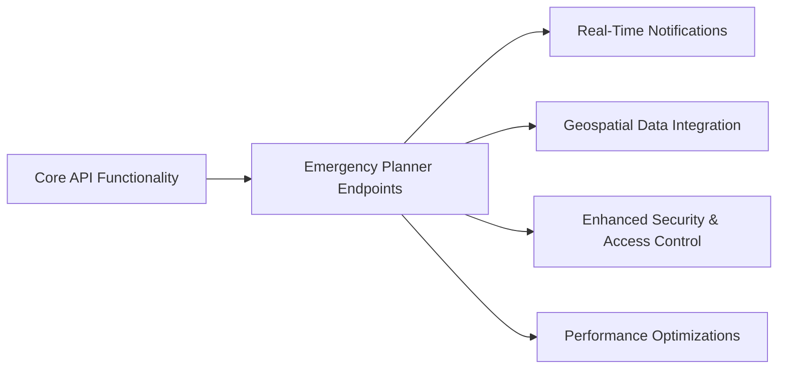

# Human Race GPT Researcher - Emergency Planner App Version

This is a modified version of GPT Researcher, tailored for use in the Human Race Emergency Planner application. 
It is designed to provide research and analysis capabilities specifically for emergency planning and related tasks.

---

**Please refer to [SETUP_INSTRUCTIONS.md](SETUP_INSTRUCTIONS.md) for detailed instructions on how to set up and run this application.**

</div>

## Phase One: Enhancements for the Emergency Planner App (Complete)

- **Dedicated Endpoints:**  
  Implemented specific endpoints for emergency planning tasks, including submission, updating, and retrieval of emergency plans.

- **Real-Time Notifications:**  
  Enabled real-time messaging to broadcast urgent alerts and updates to emergency responders.

- **Geospatial Data Integration:**  
  Integrated geolocation support to visualize incidents, resource locations, and safe zones for improved situational awareness.

- **Enhanced Security & Access Control:**  
  Added stricter token validation and role-based permissions to safeguard sensitive emergency data.

- **Performance & Scalability Optimizations:**  
  Optimized the API for high-load scenarios by enhancing data caching and load balancing capabilities.

## Architecture Overview



</div>

## Phase Two: UI Phase Plan for Admin Dashboard and Enhancements (Next)

**Deployment Target:** Heroku

This plan outlines a phased approach to enhance our Admin Dashboard UI, integrating advanced features and securing our deployment. All new components must adhere to our established styling with Tailwind CSS and DaisyUI.

## Overview

The project is divided into four phases, each with clear objectives, tasks, and testing milestones:

- **Phase 1: Project Setup and Initial Configuration**
  - **Objective:** Establish a clean workspace and dedicated branch while ensuring existing UI components function as expected.
  - **Key Tasks:** Install dependencies, validate current UI styling, and create a new branch for enhancements.
  - **Testing:** Run existing frontend tests and conduct manual validations against our established styling.

- **Phase 2: Admin Dashboard Implementation**
  - **Objective:** Develop a new Admin Dashboard page with a two-column layout (for navigation and main content) and integrate real-time API health monitoring.
  - **Key Tasks:** Create a Next.js page for the dashboard, build UI components (API Health Widget, Research Settings forms, Model Selector), and implement data fetching (via polling/SWR or SSE) from the `/health` endpoint.
  - **Testing:** Unit tests for components, integration tests for API communication, and manual verification of real-time updates and consistent styling.

- **Phase 3: Research Controls and Advanced Features**
  - **Objective:** Enhance the dashboard with controls for managing research settings, model management, and monitoring multi-agent processes.
  - **Key Tasks:** Develop UI components using React (with state management via Zustand), build new Next.js API endpoints if necessary, and implement advanced visualizations (e.g., AgentGraph for multi-agent monitoring) along with features like prompt management and analytics.
  - **Testing:** Perform thorough unit testing, stress-test API interactions, and execute integration tests to ensure seamless workflows.

- **Phase 4: Infrastructure Enhancements and Security**
  - **Objective:** Strengthen security by integrating authentication, API key management, and audit logs, and finalize deployment settings for Heroku.
  - **Key Tasks:** Implement authentication and role-based access with Supabase, set up security middleware and row-level policies, develop endpoints for API key operations and audit logs, and configure deployment settings (environment variables, build configurations).
  - **Testing:** Conduct end-to-end tests for authentication and authorization flows, complete security audits, and test the deployment on a staging Heroku environment.

## High-Level Architecture

```mermaid
graph TD
    A[Next.js Admin Dashboard] --> B[Next.js API Routes]
    A --> C[UI Components (Health Widget, Research Settings, Model Selector, AgentGraph)]
    B --> D[Python Backend API (/health, etc.)]
    D --> E[External Services (Database, Redis, Pub/Sub)]
    A --> F[Supabase Auth & Role-Based Access]
```

This phased plan ensures a structured and secure roll-out of the enhanced Admin Dashboard, focusing on reliability, real-time data integration, advanced research controls, and robust security measures.

</div>

## Future Work Overview
The following phases outline upcoming work on the project. Detailed planning phases for each block are forthcoming.

## Phase 3: Deployment to Heroku
- **Description:**  
  This phase focuses on deploying the application to Heroku. Key tasks include configuring environment variables, build settings, and ensuring that the application is fully optimized for the Heroku platform.

## Phase 4: Integration Testing with The Emergency Planner App
- **Description:**  
  In this phase, the project will undergo integration testing with The Emergency Planner App. The objective is to verify seamless interactions between the enhanced Admin Dashboard and the emergency planning functionalities, ensuring reliable real-time data exchange.

## Phase 5: Multi-Agent Implementation
- **Description:**  
  This phase will incorporate multi-agent capabilities into the system. It aims to develop new components that support concurrent agent operations, improving product quality, system scalability and resilience.

</div>

# 🔎 GPT Researcher

**GPT Researcher is an open deep research agent designed for both web and local research on any given task.** 

The agent produces detailed, factual, and unbiased research reports with citations. GPT Researcher provides a full suite of customization options to create tailor made and domain specific research agents. Inspired by the recent [Plan-and-Solve](https://arxiv.org/abs/2305.04091) and [RAG](https://arxiv.org/abs/2005.11401) papers, GPT Researcher addresses misinformation, speed, determinism, and reliability by offering stable performance and increased speed through parallelized agent work.

**Our mission is to empower individuals and organizations with accurate, unbiased, and factual information through AI.**

## Why GPT Researcher?

- Objective conclusions for manual research can take weeks, requiring vast resources and time.
- LLMs trained on outdated information can hallucinate, becoming irrelevant for current research tasks.
- Current LLMs have token limitations, insufficient for generating long research reports.
- Limited web sources in existing services lead to misinformation and shallow results.
- Selective web sources can introduce bias into research tasks.

## Demo
https://github.com/user-attachments/assets/2cc38f6a-9f66-4644-9e69-a46c40e296d4

## Architecture

The core idea is to utilize 'planner' and 'execution' agents. The planner generates research questions, while the execution agents gather relevant information. The publisher then aggregates all findings into a comprehensive report.

Steps:
* Create a task-specific agent based on a research query.
* Generate questions that collectively form an objective opinion on the task.
* Use a crawler agent for gathering information for each question.
* Summarize and source-track each resource.
* Filter and aggregate summaries into a final research report.

## Tutorials
 - [How it Works](https://docs.gptr.dev/blog/building-gpt-researcher)
 - [How to Install](https://www.loom.com/share/04ebffb6ed2a4520a27c3e3addcdde20?sid=da1848e8-b1f1-42d1-93c3-5b0b9c3b24ea)
 - [Live Demo](https://www.loom.com/share/6a3385db4e8747a1913dd85a7834846f?sid=a740fd5b-2aa3-457e-8fb7-86976f59f9b8)

## Features

- 📝 Generate detailed research reports using web and local documents.
- 🖼️ Smart image scraping and filtering for reports.
- 📜 Generate detailed reports exceeding 2,000 words.
- 🌐 Aggregate over 20 sources for objective conclusions.
- 🖥️ Frontend available in lightweight (HTML/CSS/JS) and production-ready (NextJS + Tailwind) versions.
- 🔍 JavaScript-enabled web scraping.
- 📂 Maintains memory and context throughout research.
- 📄 Export reports to PDF, Word, and other formats.

## ✨ Deep Research

GPT Researcher now includes Deep Research - an advanced recursive research workflow that explores topics with agentic depth and breadth. This feature employs a tree-like exploration pattern, diving deeper into subtopics while maintaining a comprehensive view of the research subject.

- 🌳 Tree-like exploration with configurable depth and breadth
- ⚡️ Concurrent processing for faster results
- 🤝 Smart context management across research branches
- ⏱️ Takes ~5 minutes per deep research
- 💰 Costs ~$0.4 per research (using `o3-mini` on "high" reasoning effort)

[Learn more about Deep Research](https://docs.gptr.dev/docs/gpt-researcher/gptr/deep_research) in our documentation.

## 📖 Documentation

See the [Documentation](https://docs.gptr.dev/docs/gpt-researcher/getting-started/getting-started) for:
- Installation and setup guides
- Configuration and customization options
- How-To examples
- Full API references

## ⚙️ Getting Started

### Installation

1. Install Python 3.11 or later. [Guide](https://www.tutorialsteacher.com/python/install-python).
2. Clone the project and navigate to the directory:

    ```bash
    git clone https://github.com/assafelovic/gpt-researcher.git
    cd gpt-researcher
    ```

3. Set up API keys by exporting them or storing them in a `.env` file.

    ```bash
    export OPENAI_API_KEY={Your OpenAI API Key here}
    export TAVILY_API_KEY={Your Tavily API Key here}
    ```

4. Install dependencies and start the server:

    ```bash
    pip install -r requirements.txt
    python -m uvicorn main:app --reload
    ```

Visit [http://localhost:8000](http://localhost:8000) to start.

For other setups (e.g., Poetry or virtual environments), check the [Getting Started page](https://docs.gptr.dev/docs/gpt-researcher/getting-started/getting-started).

## Run as PIP package
```bash
pip install gpt-researcher

```
### Example Usage:
```python
...
from gpt_researcher import GPTResearcher

query = "why is Nvidia stock going up?"
researcher = GPTResearcher(query=query, report_type="research_report")
# Conduct research on the given query
research_result = await researcher.conduct_research()
# Write the report
report = await researcher.write_report()
...
```

**For more examples and configurations, please refer to the [PIP documentation](https://docs.gptr.dev/docs/gpt-researcher/gptr/pip-package) page.**


## Run with Docker

> **Step 1** - [Install Docker](https://docs.gptr.dev/docs/gpt-researcher/getting-started/getting-started-with-docker)

> **Step 2** - Clone the '.env.example' file, add your API Keys to the cloned file and save the file as '.env'

> **Step 3** - Within the docker-compose file comment out services that you don't want to run with Docker.

```bash
docker-compose up --build
```

If that doesn't work, try running it without the dash:
```bash
docker compose up --build
```

> **Step 4** - By default, if you haven't uncommented anything in your docker-compose file, this flow will start 2 processes:
 - the Python server running on localhost:8000<br>
 - the React app running on localhost:3000<br>

Visit localhost:3000 on any browser and enjoy researching!


## 📄 Research on Local Documents

You can instruct the GPT Researcher to run research tasks based on your local documents. Currently supported file formats are: PDF, plain text, CSV, Excel, Markdown, PowerPoint, and Word documents.

Step 1: Add the env variable `DOC_PATH` pointing to the folder where your documents are located.

```bash
export DOC_PATH="./my-docs"
```

Step 2: 
 - If you're running the frontend app on localhost:8000, simply select "My Documents" from the "Report Source" Dropdown Options.
 - If you're running GPT Researcher with the [PIP package](https://docs.tavily.com/guides/gpt-researcher/gpt-researcher#pip-package), pass the `report_source` argument as "local" when you instantiate the `GPTResearcher` class [code sample here](https://docs.gptr.dev/docs/gpt-researcher/context/tailored-research).


## 👪 Multi-Agent Assistant
As AI evolves from prompt engineering and RAG to multi-agent systems, we're excited to introduce our new multi-agent assistant built with [LangGraph](https://python.langchain.com/v0.1/docs/langgraph/).

By using LangGraph, the research process can be significantly improved in depth and quality by leveraging multiple agents with specialized skills. Inspired by the recent [STORM](https://arxiv.org/abs/2402.14207) paper, this project showcases how a team of AI agents can work together to conduct research on a given topic, from planning to publication.

An average run generates a 5-6 page research report in multiple formats such as PDF, Docx and Markdown.

Check it out [here](https://github.com/assafelovic/gpt-researcher/tree/master/multi_agents) or head over to our [documentation](https://docs.gptr.dev/docs/gpt-researcher/multi_agents/langgraph) for more information.

## 🖥️ Frontend Applications

GPT-Researcher now features an enhanced frontend to improve the user experience and streamline the research process. The frontend offers:

- An intuitive interface for inputting research queries
- Real-time progress tracking of research tasks
- Interactive display of research findings
- Customizable settings for tailored research experiences

Two deployment options are available:
1. A lightweight static frontend served by FastAPI
2. A feature-rich NextJS application for advanced functionality

For detailed setup instructions and more information about the frontend features, please visit our [documentation page](https://docs.gptr.dev/docs/gpt-researcher/frontend/introduction).

####

[](https://gptr.dev)
[](https://docs.gptr.dev)
[](https://discord.gg/QgZXvJAccX)

[](https://badge.fury.io/py/gpt-researcher)

[](https://colab.research.google.com/github/assafelovic/gpt-researcher/blob/master/docs/docs/examples/pip-run.ipynb)
[](https://hub.docker.com/r/gptresearcher/gpt-researcher)
[](https://twitter.com/assaf_elovic)

[English](README.md) | [中文](README-zh_CN.md) | [日本語](README-ja_JP.md) | [한국어](README-ko_KR.md)

<p align="right">
  <a href="#top">⬆️ Back to Top</a>
</p>
